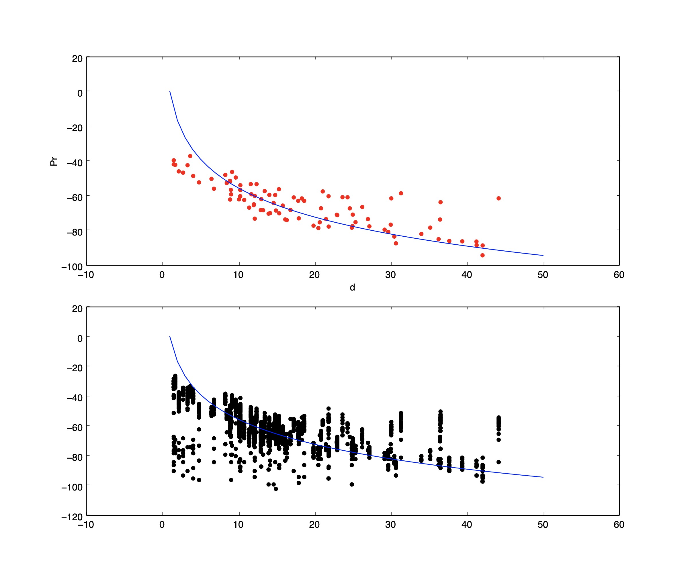

# Homework 1
$$P_R = P_TK[\frac{d_0}{d}]^\eta exp(\frac{\sigma}{10log_{10}e}N)$$ 
$$P_r = P_t + K - \eta 10log_{10}(\frac{d}{d_0}) + \Psi$$

## 0. Generializing Data Samples

In the question, several experience results were provided. The parameter affecting the result of power receiver, $P_r$ is distance d.  

So with corodinates of receivers and transmitter in different examples, the data given can be generialize into data sets with distance from transmitter and several corresponding signal power received.

## 1. Get $\eta$
<!-- $P_R$ propotion to $[\frac{d_0}{d}]^\eta$. Change in d, i.e., $kd$ yields
$$P_R\prime = [\frac{1}{k}]^\eta \cdot P_R$$
$$\eta = log_{1/k}\frac{P_R\prime}{P_R}$$
or -->
With equation on top, we can calculate the $\eta$ with 2 sets of data who has different d using the following equation:
$$P_r\prime- P_r = \eta10[log_{10}\frac{d}{d_0}-log_{10}\frac{d\prime}{d_0}] = \eta10[log_{10}\frac{d}{d\prime}]$$
$$\eta = \frac{P_r\prime- P_r}{10log_{10}\frac{d}{d\prime}}$$

Calculate $\eta$ with 2 sets among all data sets and find the average.

## 2. $\sigma$
To evaluate standard diviation, use one sample set, calculate the average signal power $\bar s$ and then 
$$\sigma = sqrt\{\frac{1}{n}\sum_i(s_i - \bar s)^2\}$$

And get the average $\sigma$ of all samples.


## 3. K
$$K = P_r - P_t + \eta 10log_{10}(\frac{d}{d_0}) - \Psi$$
where for the fixed distance d, 
$$K = \frac{1}{n}\sum_i^nK_i = \frac{1}{n}\sum_i^n[P_r - P_t + \eta10log10(\frac{d}{d_0})]$$

and get average result of all data sets.

## 4. Results
The answer for parameters are as follows:
```
n = 5.56
sigma = 5.49
K = 27.39
```
And the following is the $P_r - d$ figure. Dots for figure on top are averaged signal power, and the second figure plots all power - distance samples.
<p align="center">

</p>


## 5. Appendix
Coding: Python

```
import csv
import math
import matplotlib.pyplot as plt
import numpy as np

NUM_RECEIVERS = 8
NUM_EXPS = 12
PT = -27
D0 = 1


class recvr(object):
    def __init__(self):
        self.cor = [None, None]
        self.exps = [exps() for i in range(NUM_EXPS)]
    
    def _show(self):
        print("Cords: {}".format(self.cor))
        for exp in self.exps:
            print("No. {0}: ".format(exp.No))
            print("  sig: {0}".format(exp.sig))
            print("  sig_avg: {0}".format(exp.sig_avg))
            print("  d: {0}".format(exp.d))

    def statistics(self):
        for exp in self.exps:
            exp.statistics(self.cor)

class exps(object):
    def __init__(self):
        self.cor_trans = [None, None]
        self.sig = []
        self.No = 0
        self.d = 0

        self.sig_avg = 0

    def statistics(self, cor_recv):
        self.d = math.sqrt((cor_recv[0] - self.cor_trans[0])**2 + (cor_recv[1] - self.cor_trans[1])**2)

        self.cout_sig_avg()

    def cout_sig_avg(self):
        if len(self.sig) != 0:
            self.sig_avg = sum(self.sig)/len(self.sig)
        else:
            self.sig_avg = None


def draw(receivers, all=False):
    plt.figure()
    if all == True:
        plt.subplot(1, 2, 1)
        for receiver in receivers:
            for exp in receiver.exps:
                for item in exp.sig:
                    plt.scatter(exp.d, item, color='k')

    plt.subplot(1, 2, 2)
    for receiver in receivers:
        for exp in receiver.exps:
            if exp.sig_avg != None:
                plt.scatter(exp.d, exp.sig_avg, color='r')
    # plt.show()
    # else:
    #     for receiver in receivers:
    #         for exp in receiver.exps:
    #             if exp.sig_avg != None:
    #                 plt.scatter(exp.d, exp.sig_avg, color='r')
    #     plt.show()
    pass


def cal_eta(p1, p2, d1, d2):
    return (p1 - p2)/(10*math.log10(d2/d1))

def cal_sigma(exp):
    avg = sum(exp.sig)/len(exp.sig)
    tmp = [(x-avg)**2 for x in exp.sig]
    return math.sqrt(sum(tmp)/len(tmp))

def cal_K(exp, eta):
    return exp.sig_avg - PT + eta * 10 * math.log10(exp.d/D0)

def cal_Pr(Pt, K, eta, d, d0):
    return Pt + K - eta * 10 * math.log10(d/d0)

def cal_Pr_D_in_dB(Pt, K, eta, d, d0):
    return Pt + K - eta * d0

def plot_data():
    for receiver in receivers:
        for exp in receiver.exps:
            if exp.sig_avg != None:
                plt.scatter(exp.d, exp.sig_avg, color='r')

def plot_data_all():
    for receiver in receivers:
            for exp in receiver.exps:
                for item in exp.sig:
                    plt.scatter(exp.d, item, color='k')

def statistics(receivers):
    eta_all = []
    sigma_all = []
    K_all = []

    for no in range(NUM_EXPS):
        for i in range(NUM_RECEIVERS-1):
            if (receivers[i].exps[no].sig_avg != None) and (receivers[i+1].exps[no].sig_avg != None):
                eta_all.append(cal_eta(receivers[i].exps[no].sig_avg, receivers[i+1].exps[no].sig_avg, receivers[i].exps[no].d, receivers[i+1].exps[no].d))
    eta = sum(eta_all)/len(eta_all)
    
    for no in range(NUM_EXPS):
        for i in range(NUM_RECEIVERS):
            if len(receivers[i].exps[no].sig) != 0:
                sigma_all.append(cal_sigma(receivers[i].exps[no]))
    sigma = sum(sigma_all)/len(sigma_all)

    for no in range(NUM_EXPS):
        for i in range(NUM_RECEIVERS):
            if len(receivers[i].exps[no].sig) != 0:
                K_all.append(cal_K(receivers[i].exps[no], eta))
    
    K = sum(K_all)/len(K_all)

    plt.figure(figsize=(12, 10))
    plt.subplot(2, 1, 1)
    plot_data()
    plt.xlabel("d")
    plt.ylabel("Pr")

    x = np.linspace(1, 50)
    y = [cal_Pr(PT, K, eta, i, D0) for i in x]  
    # plt.title("$P_r$ - d K = {0}, $\eta$ = {1}, $\sigma$ = {2}".format(K, eta, sigma))

    plt.plot(x, y)

    plt.subplot(2, 1, 2)
    plot_data_all()
    plt.plot(x, y)

    plt.savefig("./result.jpg")
    # plt.show()
    print(eta, sigma, K)
    
    pass

if __name__ == "__main__":
    f_exps = ["./HW1_Data/wifiExp{0}.csv".format(i) for i in range(7, 19)]
    f_receivers = "./HW1_Data/receiverXY.csv"
    f_transmitters = "./HW1_Data/transmitterXY.csv"
    
    receivers = [recvr() for i in range(NUM_RECEIVERS)]

    with open(f_receivers) as f:
        reader = csv.reader(f)
        i = 0
        for row in reader:
            receivers[i].cor = [float(x) for x in row]
            i += 1
        f.close()

    with open(f_transmitters) as f:
        reader = csv.reader(f)
        i = 0
        for row in reader:
            for receiver in receivers:
                receiver.exps[i].cor_trans = [float(x) for x in row]
            i += 1

    for no in range(NUM_EXPS):
        for i, v in enumerate(receivers):
            receivers[i].exps[no].No = no + 7
        with open(f_exps[no]) as f:
            reader = csv.reader(f)
            for row in reader:
                for i in range(NUM_RECEIVERS):
                    if float(row[i+1]) != 500:
                        receivers[i].exps[no].sig.append(float("-"+row[i+1]))

    for receiver in receivers:
        receiver.statistics()

    # for receiver in receivers:
    #     receiver._show()

    # draw(receivers)
    statistics(receivers)
    pass
```