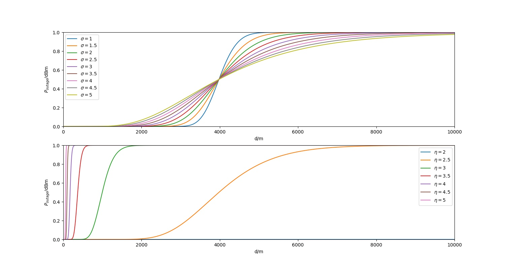

# HM 2

## 1. Outage Probability
### a.
$$SNR = \frac{P_{out}}{N}$$
or
$$SNR_{dB} = P_{out dBm} - N_{dBm}$$
$\Rightarrow$
$$P_{out dBm} = SNR_{dB} + N_{dBm} = -90$$

### b. 
Path loss
$$L = \frac{P_t}{P_r}$$
and in dB, we get
$$L_{dB} = P_{tdBm} - P_{rdBm}$$
$$P_{rdBm} = P_{tdBm} - L_{dB}$$
$\Rightarrow$
$$K = P_{rdBm} - P_{tdBm} + \eta\cdot10log\frac{d}{d_0} = - L_{dB} + \eta\cdot10log\frac{d}{d_0} = -30$$

### c. result
Draw the figure of $P_r - d$ as shown below.  
And to calculate $P_{outage}$, we use the following equations:  

$$P_{outage} = 1 - Q(\frac{P_{out} - P_{r}}{\sigma})$$

where $Q(\cdot)$ is the Q function for standard normal distribution.

For $\eta$, as $P = P_t + K - \eta\cdot d$, increasing in $\eta$ clearly result increasing for $P$, which results in longer distance when outage occured, as shown in the figure. 

<p align="center">

</p>
<p align="center">

</p> 

On ther other hand, change in $\sigma$ will not result in the same thing. It does not influence $P-d$ curve. It appears in $1-Q(\frac{P_{out} - P}{\sigma})$. As we notice, before $P=-90$, $P_{outage} - P < 0$. At this time, higher the $\sigma$ is, lower the $Q(\frac{P_{out} - P}{\sigma})$ is, and higher the $P_{outage}$ is. And after $P < -90$, higher in $\sigma$ results in lower the $P_{outage}$

The following figures are ploted for d in meters.
<p align="center">

</p>
<p align="center">

</p>

## 2. 

As usual, determine parameters for $P_r-d$.
$$P_r = P_t + K - n10log(\frac{d}{d0}) = P_t + K$$

$$K = P_R|_{d = 1} - P_t = -33$$

$$SNR_{dB} = P_{rdBm} - N_{dBm}$$

We first calculate $P_r$ for each distence d and get SNR. Then compare with fig 8(a) to get goodput.  
Distence d in the figure set is in meters. The y-axis for each figure is $P_r$, SNR, goodput rate, repectively.
<p align="center">

</p>
<!-- <p align="center">

</p> -->

## 3. 
First generate power_ray in dB for different mobile speeds [0, 5, 10, 15, 20, 25], and discretize them using 3.25dBm as threshold. The following figure plots state changes from [0, 50] for different speed.
<p align="center">

</p>
The list below indicates probability distribution for different speeds. 

|speed|P00|P01|P10|P11|
| --- | --- | --- | --- | --- |
|0 |0.3027|0.6973|0.1767|0.8233|
|5 |0.3150|0.6850|0.1823|0.8177|
|10 |0.3560|0.6440|0.2148|0.7852|
|15 |0.3529|0.6471|0.1747|0.8253|
|20 |0.3317|0.6683|0.1756|0.8244|
|25 |0.3428|0.6572|0.1947|0.8053|

<!-- ## 4. Appenxix: codes

### a. Q1

```
import numpy as np
import math
import matplotlib.pyplot as plt
from scipy.stats import norm


# in dBm or dB:
PT = 30
ETA = 2.5
SIGMA = 3 
NOISE = -100
D0 = 1
SNR = 10

Pout = SNR + NOISE
K = -30 + ETA *10 * math.log10(1/D0)

def Q_function(x):
    return 1 - norm.cdf(x)


def Poutage(_sigma, _p_out, _p_r):
    return 1 - Q_function((_p_out - _p_r)/_sigma)

def Pr(d, _p_t, _k, _eta, _d0):
    return _p_t + _k - _eta * 10 * math.log10(d/_d0)

def Pr_d_dB(d, _p_t, _k, _eta, _d0):
    return _p_t + _k - _eta * d

def f1():
    x_range = [1, 10000]
    x = list(np.linspace(x_range[0], x_range[1], 10000))
    x_log = [10 * math.log10(item) for item in x]
    y = [Poutage(SIGMA, Pout, Pr(item, PT, K, ETA, D0)) for item in x]

    sigmas = [1, 1.5, 2, 2.5, 3, 3.5, 4, 4.5, 5]
    y1 = [[]]*len(sigmas)
    etas = [2, 2.5, 3, 3.5, 4, 4.5, 5]
    y2 = [[]]*len(etas)
    y0 = [[]]*len(etas)

    # log
    plt.figure()
    plt.xlim(0, 40)
    for i in range(len(etas)):
        y0[i] = [Pr_d_dB(item, PT, K, etas[i], D0) for item in x_log]
        plt.plot(x_log, y0[i], label="$\eta = {}$".format(etas[i]))
    plt.hlines(-90, 0, x_range[1], linestyles="dashed")
    plt.xlabel("d/dB")
    plt.ylabel("$P_r$/dBm")
    plt.legend()
    plt.savefig("./Q1_result3.jpg")

    plt.figure(figsize=[10, 7])
    plt.subplot(2, 1, 1)
    plt.ylim(0, 1)
    plt.xlim(0, 40)
    for i in range(len(sigmas)):
        y1[i] = [Poutage(sigmas[i], Pout, Pr_d_dB(item, PT, K, ETA, D0)) for item in x_log]
        plt.plot(x_log, y1[i], label="$\sigma = {}$".format(sigmas[i]))
    plt.xlabel("d/dB")
    plt.ylabel("$P_{outage}$/dBm")
    plt.legend()

    plt.subplot(2, 1, 2)
    plt.ylim(0, 1)
    plt.xlim(0, 40)
    for i in range(len(etas)):
        y2[i] = [Poutage(SIGMA, Pout, Pr_d_dB(item, PT, K, etas[i], D0)) for item in x_log]
        plt.plot(x_log, y2[i], label="$\eta = {}$".format(etas[i]))
    plt.legend()
    plt.xlabel("d/dB")
    plt.ylabel("$P_{outage}$/dBm")
    plt.savefig("./Q1_result4.jpg")


    plt.figure()
    for i in range(len(etas)):
        y0[i] = [Pr(item, PT, K, etas[i], D0) for item in x]
        plt.plot(x, y0[i], label="$\eta = {}$".format(etas[i]))
    plt.hlines(-90, 0, x_range[1], linestyles="dashed")
    plt.legend()
    plt.xlabel("d/m")
    plt.ylabel("$P_r$/dBm")
    plt.savefig("./Q1_result1.jpg")

    plt.figure(figsize=[10, 7])
    plt.subplot(2, 1, 1)
    plt.ylim(0, 1)
    plt.xlim(0, x_range[1])

    for i in range(len(sigmas)):
        y1[i] = [Poutage(sigmas[i], Pout, Pr(item, PT, K, ETA, D0)) for item in x]
        plt.plot(x, y1[i], label="$\sigma = {}$".format(sigmas[i]))
    plt.legend()
    plt.xlabel("d/m")
    plt.ylabel("$P_{outage}$/dBm")


    plt.subplot(2, 1, 2)
    plt.ylim(0, 1)
    plt.xlim(0, x_range[1])

    for i in range(len(etas)):
        y2[i] = [Poutage(SIGMA, Pout, Pr(item, PT, K, etas[i], D0)) for item in x]
        plt.plot(x, y2[i], label="$\eta = {}$".format(etas[i]))
    plt.legend()
    plt.xlabel("d/m")
    plt.ylabel("$P_{outage}$/dBm")
    plt.savefig("./Q1_result2.jpg")

    pass

def f2():
    
    pass

if __name__ == "__main__":
    f1()
    pass
```

### b. Q2
```
import numpy as np
import math
import matplotlib.pyplot as plt
from scipy.stats import norm

PT = 23
N = -90
D0 = 1
K = -10 - PT

def cal_pr(d, _pt, _k, _eta, _d0):
    return _pt + _k - _eta * 10 * math.log10(d/_d0)

def cal_pr_d_in_dB(d, _pt, _k, _eta, _d0):
    return _pt + _k - _eta * (d - 10 * math.log10(_d0))

def cal_SNR(_pr, _n):
    return _pr - _n

def cal_goodput(_snr):
    if _snr < 2.5:
        return 0
    elif _snr < 6:
        return 6
    elif _snr < 8:
        return 11
    elif _snr < 9:
        return 16
    elif _snr < 16:
        return 20
    elif _snr < 21:
        return 28
    elif _snr < 22:
        return 34
    else:
        return 37


def f2():
    etas = [2, 4]
    x = list(np.linspace(1, 1000, 1000))
    x_log = [10 * math.log10(d) for d in x]
    pr = [None] * len(etas)
    SNR = pr[:]
    goodput = pr[:]

    plt.figure(figsize=[10, 8])
    sub1 = plt.subplot(3, 1, 1)
    sub2 = plt.subplot(3, 1, 2)
    sub3 = plt.subplot(3, 1, 3)
    for i in range(len(etas)):
        pr[i] = [cal_pr(d, PT, K, etas[i], D0) for d in x]
        sub1.plot(x, pr[i], label="$\eta$={}".format(etas[i]))

        SNR[i] = [cal_SNR(p, N) for p in pr[i]]
        sub2.plot(x, SNR[i], label="$\eta$={}".format(etas[i]))

        goodput[i] = [cal_goodput(snr) for snr in SNR[i]]
        sub3.plot(x, goodput[i], label="$\eta$={}".format(etas[i]))
    pass
    sub1.ylim = [-130, 0]
    sub1.legend()
    sub2.ylim = [-30, 80]
    sub2.legend()
    sub3.legend()
    plt.savefig("./Q2_result1.jpg")

    plt.figure(figsize=[10, 8])
    sub1 = plt.subplot(3, 1, 1)
    sub2 = plt.subplot(3, 1, 2)
    sub3 = plt.subplot(3, 1, 3)
    for i in range(len(etas)):
        pr[i] = [cal_pr_d_in_dB(d, PT, K, etas[i], D0) for d in x_log]
        sub1.plot(x_log, pr[i], label="$\eta$={}".format(etas[i]))

        SNR[i] = [cal_SNR(p, N) for p in pr[i]]
        sub2.plot(x_log, SNR[i], label="$\eta$={}".format(etas[i]))

        goodput[i] = [cal_goodput(snr) for snr in SNR[i]]
        sub3.plot(x_log, goodput[i], label="$\eta$={}".format(etas[i]))
    pass
    sub1.ylim = [-130, 0]
    sub1.legend()
    sub2.ylim = [-30, 80]
    sub2.legend()
    sub3.legend()
    plt.savefig("./Q2_result2.jpg")


if __name__ == "__main__":
    f2()
    pass
```
### c. Q3

```
import numpy as np
import math
import matplotlib.pyplot as plt
from scipy.stats import norm
import csv


def cal_mc1(ls):
    # p00 p01 p10 p11
    p = [0] * 4 
    nums = [0, 0]
    for i in range(len(ls) - 1):
        if ls[i] == 0:
            nums[0] += 1
            if ls[i+1] == 0:
                p[0] += 1
            else:
                p[1] += 1
        else:
            nums[1] += 1
            if ls[i+1] == 0:
                p[2] += 1
            else:
                p[3] += 1
    p[0] /= nums[0]
    p[1] /= nums[0]
    p[2] /= nums[1]
    p[3] /= nums[1]
    return p

def f3():
    speeds = [0, 5, 10, 15, 20, 25]
    powers = [[]] * len(speeds)
    states = powers[:]
    ps = states[:]
    x = list(np.linspace(1, 2000, 2000))

    plt.figure()
    for i in range(len(speeds)):
        with open("./Q3_{}.csv".format(speeds[i])) as f:
            reader = csv.reader(f, delimiter=",")
            for row in reader:
                powers[i] = row
        f.close()
        states[i] = [sep(float(x)) for x in powers[i]]
        ps[i] = cal_mc1(states[i])

        plt.subplot(len(speeds), 1, i+1)
        plt.plot(x, states[i], label="speed = {}".format(speeds[i]))
        plt.legend()
        plt.xlim(1, 50)
    plt.savefig("./Q3_result.jpg")
    with open("./Q3_result.csv", "w") as f:
        writer = csv.writer(f)
        writer.writerow(["Speed", "P00", "P01", "P10", "P11"])
        for i in range(len(speeds)):
            writer.writerow([str(speeds[i])] + [ str(ps[i][x]) for x in range(4)])
    f.close()
    with open("./Q3_result_table.csv", "w") as f:
        writer = csv.writer(f)
        for i in range(len(speeds)):
            writer.writerow(["|{0}|{1:.4f}|{2:.4f}|{3:.4f}|{4:.4f}|".format(speeds[i], ps[i][0], ps[i][1], ps[i][2], ps[i][3])])
    f.close()
    pass

def sep(x):
    if x >= 3.23:
        return True
    else:
        return False

if __name__ == "__main__":
    f3()
``` -->


